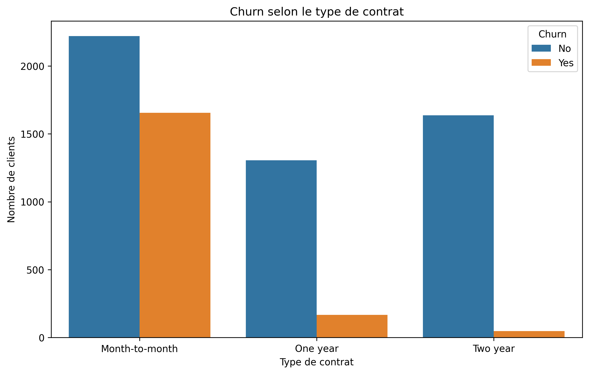

# Telco Customer Churn Analysis

Projet personnel Data Science / BI – Février 2026

**Dataset** : Telco Customer Churn (Kaggle) – 7043 clients, 21 colonnes  
Lien : https://www.kaggle.com/datasets/blastchar/telco-customer-churn  
Taux de churn ≈ 26.5 %

## Visualisations

### 1. Churn selon le type de contrat
  
Les contrats mensuels ont un churn très élevé.

### 2. Distribution de la tenure selon churn
  
Les churners sont concentrés dans les faibles durées (0-10 mois).

### 3. MonthlyCharges selon churn
  
Les clients qui partent payaient en moyenne plus cher.

### 4. Churn selon la méthode de paiement
  
La méthode Electronic check est associée à plus de churn.

**Outils** : Python (Pandas, Seaborn, Matplotlib) – Google Colab – GitHub
