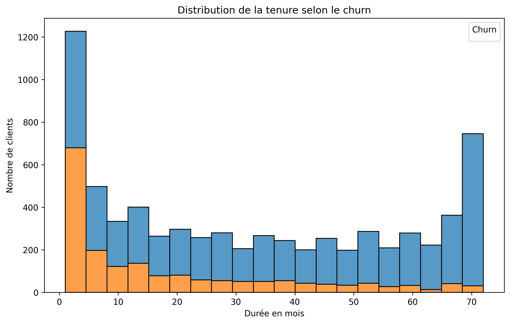
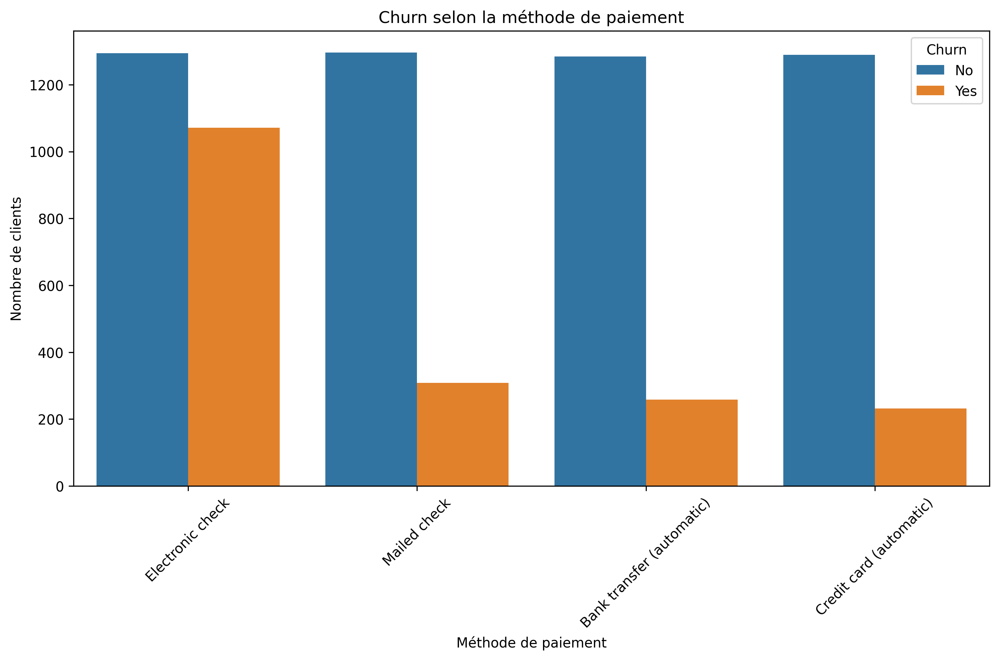

# Telco Customer Churn Analysis

Projet personnel Data Science / BI – Février 2026

**Dataset** : Telco Customer Churn (Kaggle) – 7043 clients, 21 colonnes  
Lien : https://www.kaggle.com/datasets/blastchar/telco-customer-churn  
Taux de churn ≈ 26.5 %

## Visualisations

### 1. Churn selon le type de contrat
  
Les contrats mensuels ont un churn très élevé.

### 2. Distribution de la tenure selon churn
  
Les churners sont concentrés dans les faibles durées (0-10 mois).

### 3. MonthlyCharges selon churn
  
Les clients qui partent payaient en moyenne plus cher.

### 4. Churn selon la méthode de paiement
  
La méthode Electronic check est associée à plus de churn.

**Outils** : Python (Pandas, Seaborn, Matplotlib) – Google Colab – GitHub
## Modélisation simple (Logistic Regression)

Objectif : prédire si un client va churner (Yes/No) avec 4 features simples.

**Features utilisées** : tenure, MonthlyCharges, Contract_One year, Contract_Two year

**Résultats** :
- Accuracy : [remplace par ton score, ex. 0.7956 (79.56 %)]
- Rapport de classification :
  - No (resté) : precision ≈ 0.85, recall ≈ 0.90, f1-score ≈ 0.87
  - Yes (churn) : precision ≈ 0.62, recall ≈ 0.55, f1-score ≈ 0.58

**Matrice de confusion** (exemple) :
Matrice de confusion :
[[916 117]
 [189 185]]

 
**Conclusion** :  
Le modèle est simple mais déjà mieux que le hasard (50 %). Les clients avec faible tenure et charges élevées sont les plus à risque.

Prochaines étapes : améliorer avec plus de features (encoding des autres catégorielles, Random Forest, etc.)
